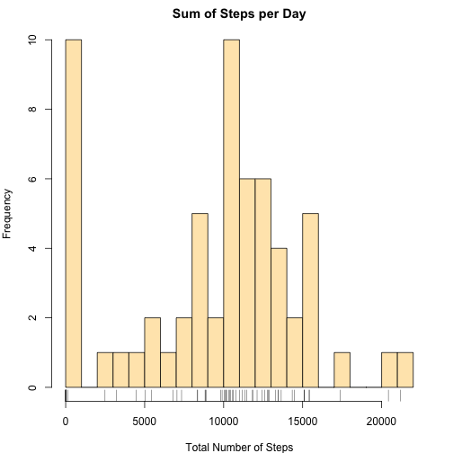
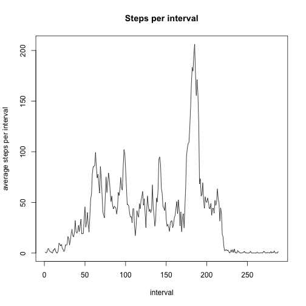
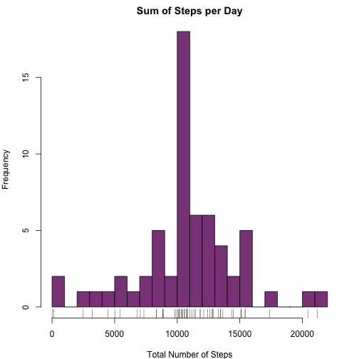
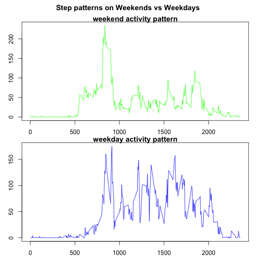

## Loading and preprocessing the data

```r
act <- read.csv("activity.csv")
```

```
## Warning in file(file, "rt"): cannot open file 'activity.csv': No such file
## or directory
```

```
## Error in file(file, "rt"): cannot open the connection
```
## What is mean total number of steps taken per day?
### Gather and process data

```r
act <- read.csv("activity.csv")
```

```
## Warning in file(file, "rt"): cannot open file 'activity.csv': No such file
## or directory
```

```
## Error in file(file, "rt"): cannot open the connection
```

```r
act$date <-as.factor(act$date)
act2 <- split(act, act$date)
```
### Calculate the sum per day

```r
sum_per_day <- numeric()
for (k in act2) {
      a <- sum(k$steps, na.rm=TRUE)
	sum_per_day <- c(a, sum_per_day)
	}
sum_per_day <- as.numeric(sum_per_day)
```
### Create a histogram showing the frequncy of each total of steps

```r
mean <- mean(sum_per_day)
median <- median(sum_per_day)
par(mar = c(4, 4, 2, 2))
hist(sum_per_day, main = "Sum of Steps per Day", xlab = "Total Number of Steps", col = "wheat1", breaks = 30)
rug(sum_per_day)
```

 
## What is the average daily activity pattern?
### Gather and process data

```r
act <- read.csv("activity.csv")
```

```
## Warning in file(file, "rt"): cannot open file 'activity.csv': No such file
## or directory
```

```
## Error in file(file, "rt"): cannot open the connection
```

```r
act$interval <- as.factor(act$interval)
act2 <- split(act, act$interval)
```
### Calculate the mean of steps per interval

```r
mean_per_int <- numeric()
for (k in act2) {
	a <- mean(k$steps, na.rm=TRUE)
	mean_per_int <- c(a, mean_per_int)
	}
mean_per_int <- as.numeric(mean_per_int)
```
### Create a plot showing the daily activity pattern

```r
plot( x = unique(as.numeric(act$interval)), y = mean_per_int, type = "l", ylab = "average steps per interval", xlab = "interval", main = "Steps per interval")
```

 
## Imputing missing values
### Gather and process data

```r
act <- read.csv("activity.csv")
```

```
## Warning in file(file, "rt"): cannot open file 'activity.csv': No such file
## or directory
```

```
## Error in file(file, "rt"): cannot open the connection
```
## Fill data into na values

```r
act.na <- (act$steps)[is.na(act$steps)]
missing_values <- length(act.na)
act.na <- act
act.na$steps[is.na(act.na$steps)] <- mean(act.na$steps, na.rm = TRUE)
act.na$date <-as.factor(act.na$date)
act3 <- split(act.na, act.na$date)
```
### sum per day

```r
sum_per_day <- numeric()
for (k in act3) {
      a <- sum(k$steps, na.rm=TRUE)
	sum_per_day <- c(a, sum_per_day)
	}
sum_per_day <- as.numeric(sum_per_day)
```
### output

```r
mean <- mean(sum_per_day)
median <- median(sum_per_day)
par(mar = c(4, 4, 2, 2))
hist(sum_per_day, main = "Sum of Steps per Day", xlab = "Total Number of Steps", ylab = "Frequency", col = "orchid4", breaks = 30)
rug(sum_per_day)
text(paste("The average number of steps per day is", as.character(mean)))
```

```
## Warning in xy.coords(x, y, recycle = TRUE): NAs introduced by coercion
```

```r
text(paste("The median number of steps per day is", as.character(median)))
```

```
## Warning in xy.coords(x, y, recycle = TRUE): NAs introduced by coercion
```

 
## Are there differences in activity patterns between weekdays and weekends?
### Gather and process data

```r
act <- read.csv("activity.csv", stringsAsFactors = FALSE)
```

```
## Warning in file(file, "rt"): cannot open file 'activity.csv': No such file
## or directory
```

```
## Error in file(file, "rt"): cannot open the connection
```

```r
act.na <- (act$steps)[is.na(act$steps)]
missing_values <- length(act.na)
act.na <- act
act.na$steps[is.na(act.na$steps)] <- mean(act.na$steps, na.rm = TRUE)
```
### Add a factor classifying data into weekday and weekend categories

```r
act$date <- as.character(act$date)
act$date <- as.Date(act$date, format = "%Y-%m-%d")
weekday <- sapply(act$date, weekdays)
for (i in 1:length(weekday)) {
    if ((weekday[i] == "Saturday") | (weekday[i] == "Sunday")) 
      	{weekday[i] = "weekend"}
    else {weekday[i] = "weekday"}
}
act$weekday <- as.factor(weekday)
```
### Separate data by weekday/weekend and by interval

```r
act4 <- split(act, act$weekday)
act5 <- act4$weekday
act5$interval <- as.factor(act5$interval)
act5 <- split(act5, act5$interval)
act6 <- act4$weekend
act6$interval <- as.factor(act6$interval)
act6 <- split(act6, act6$interval)
```
### Calculate the mean of the steps per interval

```r
mpi_we <- numeric()
for (k in act5) {
	a <- mean(k$steps, na.rm=TRUE)
	mpi_we <- c(mpi_we, a)
	}
mpi_we <- as.numeric(mpi_we)
mpi_wd <- numeric()
for (k in act6) {
	a <- mean(k$steps, na.rm=TRUE)
	mpi_wd <- c(mpi_wd, a)
	}
mpi_wd <- as.numeric(mpi_wd)
```
### Create a plot contrasting weekday and weekend step patterns using the base plotting system

```r
par(mar = c(2, 3, 1, 1), oma = c(0, 0, 2, 0), mfcol = (c(2,1)))
plot( x = unique(as.numeric(act$interval)), y = mpi_we, type = "l", ylab = "number of steps", xlab = "interval", main = "weekend activity pattern", col = "green")
plot( x = unique(as.numeric(act$interval)), y = mpi_wd, type = "l", ylab = "number of steps", xlab = "interval", main = "weekday activity pattern", col = "blue")
title(main = "Step patterns on Weekends vs Weekdays", outer = TRUE)
```

 
